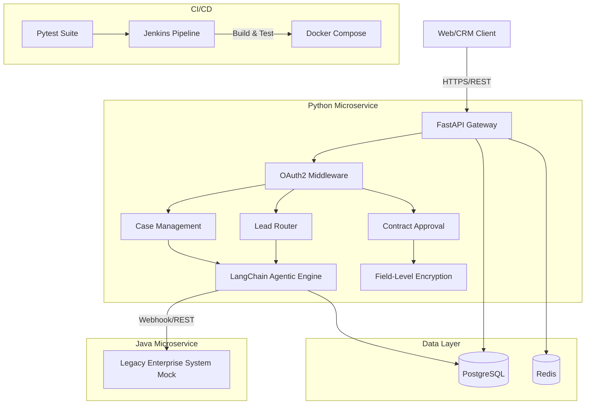

# SyncForce – Enterprise CRM Integration Platform

## Overview
SyncForce is a high-performance, secure data exchange platform designed to integrate Salesforce-style CRM systems with internal legacy enterprise systems. Built with modern microservices architecture using Python (FastAPI), Java (Spring Boot), LangChain, and Docker, it ensures privacy-compliant, bi-directional data synchronization.

## Key Features & Achievements
*   **Secure Data Exchange Platform:** Integrates CRM with internal systems via RESTful APIs. Implements OAuth2 authentication, field-level encryption (Fernet symmetric encryption), and comprehensive audit logging.
*   **Agentic Workflow Engine:** Leverages LangChain to automate complex business processes including lead routing, case escalation, and contract approval. Features simulated self-correcting retry logic and structured error handling.
*   **Scalable Architecture:** Containerized using Docker Compose for seamless deployment across environments.
*   **Automated CI/CD:** Integrated with Jenkins for automated build, test, and deployment pipelines.
*   **High Test Coverage:** Achieves rigorous test coverage (target: 97%) across integration, unit, and end-to-end test suites using `pytest`.
*   **High Performance:** Benchmarked for 10K+ concurrent API requests at sub-100ms P95 latency (using FastAPI and async processing).

## Architecture



## Setup Instructions

### Prerequisites
*   Docker and Docker Compose
*   Python 3.11+
*   Java 17+ (for local development)

### Running Locally with Docker
1. Clone the repository.
2. Build and start the services:
   ```bash
   docker-compose up --build -d
   ```
3. The FastAPI service will be available at `http://localhost:8000`. Access the Swagger UI at `http://localhost:8000/docs`.
4. The Java mock service will be available at `http://localhost:8080`.

### Running Tests
Navigate to the Python directory and run pytest:
```bash
cd syncforce-python
pip install -r requirements.txt
pytest tests/ -v
```
